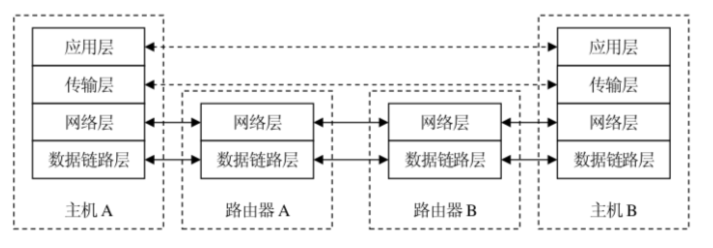
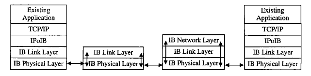
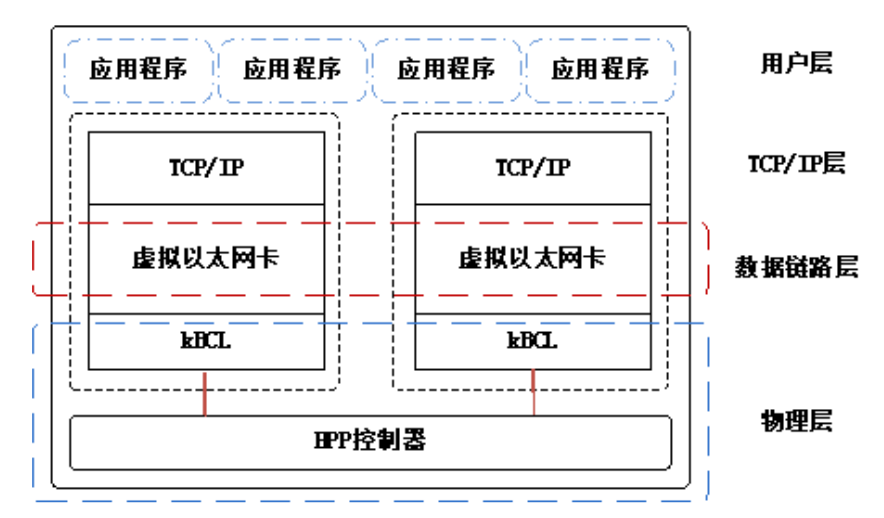
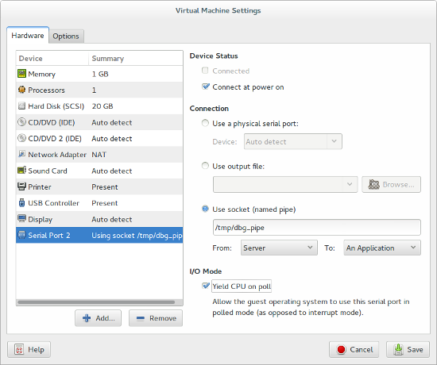
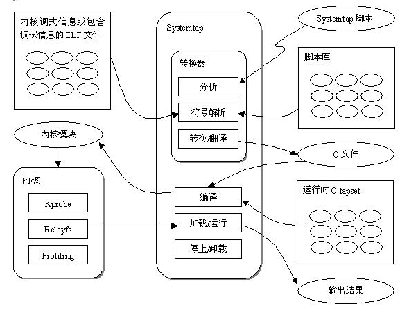

# 高性能融合网络TCP/IP通信协议的设计与实现 #

## 摘要 ##

## 引言 ##
计算机应用技术的不断发展，使得高性能计算应用范围不断扩大，已逐渐从科学计算领域，扩展到产品设计和大数据处理[pHPC平台TCP/IP通信优化关键技术研究]。随着云计算技术的兴起，高性能计算和云计算两个领域开始走向融合。一方面，高性能计算领域成熟的加速计算和网络拓扑给云计算带来了技术支撑。另一方面，云计算领域成熟的虚拟化技术和资源管理手段给高性能计算机的设计带来了新的可能。这种融合的趋势对高性能融合互连网络通信系统提出了新的需求和挑战。本文将设计并实现一套机制，为融合互连网络增加透明的高性能TCP/IP通信功能。

### 高性能计算和云计算的融合 ###

#### 高性能计算 ####
计算机淡诞生以来,运算速度一直是其发展的主要驱动力。计算机经历了大/巨型机、MPP、集群等发展阶段，性能平均每4年增长10倍。图[]展示了全球高性能计算机TOP500的性能变化趋势。十九世纪八十年代的巨型机，采用向量处理单元和SMP(Symmetric Multi-Processing, 对称多处理机系统)节点控制器，运行多线程的操作系统，以机柜的形式展现在人们面前。但它采用的向量化编程方式，编程难度大。上世纪九十年代的MPP（Massive Parallel Processing, 大规模并行处理）超级计算机，采用微处理器和NIC控制器，运行主从式操作系统，支持MPI(Message Passing Interface, 消息传递接口)编程，通常以机仓的形式呈现。2000年的刀锋式高性能计算机，采用集群的架构，使用集群管理软件管理，由multi-stage网互连。2010年的HPP体系结构，采用异构的计算单元和GAS(Global Address Space, 全局物理地址空间)。目前，我国的高性能计算机正在走向100PF(十亿亿次)，甚至艾级（百亿亿次）的量级。

高性能计算机的传统应用领域主要包括科学和工程计算，如大气模拟、数值分析等。主要运用于研究所、高校和计算中心等场所。

#### 云计算 ####
近年来，大数据的发展如火如荼。大数据的发展推动了云计算发展的进程，并引起了学术界和工业界的广泛关注。云计算中的虚拟化技术在数据中心的构建起到了重要的作用，通过系统虚拟化，单一计算机的多个虚拟机可以整合多台物理机器的功能。云计算的运用场景主要是公司企业，如百度云、阿里云，以及各地云计算中心，如北京云计算中心、南京云计算中心等。

虚拟化技术带来了管理上的方便，但其本身带来了性能损失，无法满足多种业务的需求。尤其是大规模机器学习模型的应用特征更加类似于高性能计算，需要高并发的计算和通信。云计算环境下海量数据的通信，也离不开高性能的通信系统。文献[用户级通信协议BCL-3对IP协议支持的研究]指出，集群系统只有10%用来作科学计算，其余80~90%都用于事务处理和信息服务。在大数据时代，云计算中心、数据中心需要借助高性能计算硬件平台，利用平台提供的高效网络、计算、容错和存储资源，加速信息处理。

#### 融合互连网络通信系统 ####
针对二者融合的趋势，中国科学院计算技术研究所设计实现了高性能融合互连网络通信系统，简称融合互连网络通信系统。

### 与TCP/IP融合 ###
云计算中心、数据中心的基于IP协议的应用程序和协议栈并不能直接运行在融合互连网络通信系统之上。由于应用角度的差异，两者编程思路和编程接口差异很大。目前的数据中心和云计算中心大量使用IP应用程序，采用Socket等技术，基于TCP/IP及其衍生的应用层协议栈实现。具有代表性的IP应用程序如：基于HTTP协议的浏览器和网络应用,基于FTP协议的文件分享站点,基于SMTP、POP3协议的邮件应用以及常用的telnet,DNS服务等。

让融合控制器在融合高性能计算和云计算的同时，进一步与以太网融合，就是搭建了前瞻技术和成熟技术之间的桥梁。从而使现有IP应用程序和协议栈不做任何更改便能利用高性能平台带来的带宽和性能优势，让高性能融合互连网络通信系统展现更强的生命力。这就是本课题的意义。如何实现与以太网的融合，就是本文需要解决的问题。

### 相关术语 ###
本小节介绍文中讨论时的相关约定和缩写。

8个位的量在计算机学科被称为字节（byte），但网络相关的文献中被称为octet。我们沿用这个传统。

当涉及TCP/IP网络协议的分层时，使用基于OSI参考模型的通称Ln协议术语。如L2、L3和L4分别用来表示链路层、网络层和传输层。多数情况下，L2为以太网的同义词，L3指IPv4或IPv6，L4指UDP、TCP、ICMP。

### 主要工作及贡献 ###
本文以融合互连网络通信系统为基础，分析了TCP/IP在Linux中的实现原理，设计并实现了一套机制，使融合互连网络通信系统透明地支持TCP/IP协议及上层应用。具体包括：

1. 调研了融合互连网络通信系统的设计架构，分析了软件部分的BCL通信库实现原理，同时深入探讨Linux网络子系统的工作原理和TCP/IP协议栈的实现，找到BCL通信和TCP/IP通信的差异。

2. 设计并实现了虚拟以太网卡YAVIS，衔接上述差异。YAVIS作为Linux模块被插入到操作系统中，基于kBCL（内核BCL）通信库接口，完成了封装分发TCP/IP数据帧的功能，从操作系统驱动层为融合互连网络通信系统增加了TCP/IP支持。性能分析结果表明，YAVIS通信延迟相比于普通千兆网卡有一个数量级的提升（十微秒级），带宽较普通千兆网卡提升近2倍。

3. 使用轮询方式优化了YAVIS性能。采用了两种轮询方式：高精度定时器轮询和NAPI轮询。前者具有较高的灵活性，后者可以获得更高的通信性能。

4. 研究了Linux内核模块编程和调试方法，分析了日志调试、SystemTap调试工具和KGDB交互式调试工具在内核编程中的使用。

### 组织结构 ###
本文致力于为融合互连网络通信系统提供TCP/IP协议，设计并实现虚拟以太网卡YAVIS，并对其性能进行了评测和分析。本文共分六章。

## 相关研究 ##
本节将分为纵向和横向两部分，分别介绍本课题的研究基础和国内外相近的研究。研究基础将包括TCP/IP和高性能通信系统及其相关话题。剩余篇幅将介绍Infiniband标准里解决与以太网融合问题所采用的IPoIB和EoIB技术。

### TCP/IP通信技术简介 ###
TCP/IP作为最重要的网络协议，也是第一个被规范化定义的网络协议，是网际协议族的代名词。所以通常TCP/IP有两层内涵：狭义上指Transmission Control Protocol（传输控制协议）和Internet Protocol（网际协议）的组合，广义上指Internet Protocol suite（网际协议族）。网际协议族是包含传输控制协议和网际协议的更大的概念。在本文中，TCP/IP指代后者。以太网是TCP/IP的一种实现。

TCP/IP作为典型的分层协议，具有如图[]四层结构。

应用层提供了不同主机间（也可以是同一个主机）不同应用程序之间传递用户数据的场所。这些应用程序利用下层如传输层提供的可信或不可信通信管道，与其它进程通信。参与通信的对象按照应用架构分成诸如C/S、P2P等网络结构。运作在这一层的协议主要包括SMTP、FTP、SSH、HTTP等，同时支撑着WWW和E-MAIL等涵盖互联网几乎所有领域的服务。应用层寻址方式通过端口方式进行。

传输层进行主机到主机的通信。这里的主机可以是同一台机器，也可以是不同的机器。如果是不同的机器，它们可以在一个本地网络中，也可以在路由器连接的不同网络中。传输层为应用的通信需求提供了通道。传输层常用的两种协议分别是UDP和TCP。前者提供不可靠的数据报服务，后者提供流控、连接建立和可靠数据通信。

网际层负责在各个网络边界处完成数据报的交换。它采用单一的网络接口来屏蔽低层次的真实拓扑细节。TCP/IP协议族的寻址和路由都是在这一层完成的。IP是网际层最重要的协议。它使用IP地址完成寻址。网络层通过地址解析协议(ARP)和反向地址解析协议(RARP)完成IP地址与下层MAC地址的转换过程，是网际层和链路层的桥梁。

链路层应用与本地网络内部的底层通信。这一层次包含描述本地网络拓扑结构的协议和传输数据到邻居节点的接口。链路层可以在网卡驱动程序、VPN或者专用芯片中实现。这一层次的寻址方式可以是MAC地址。

### 高性能融合互连网络通信系统介绍 ###
为了解决高性能计算和云计算对高性能融合互连网络通信性能和I/O资源可灵活管理的需求，高性能计算机研究中心提出了融合互连网络通信系统。融合互连网络通信系统是一套软硬件结合的系统架构。

一个完整的通信系统如图1-6包括两部分，一部分是通信硬件，另一部分是通信软件。通信硬件分为两层，分为融合互连网络接口控制器FFC（Fusion Fabric Controllor）和硬件接口。而通信软件分为两部分，其中一部分是宿主机部分的通信软件，另一部分是虚拟机内的通信软件。它们共同包括用户级驱动、内核级驱动、TCP/IP协议栈、软件通信接口。通信系统在通信软件和通信硬件的协同设计下为上层的应用程序提供支撑，来达到最大的通用性和I/O通信性能。

整个通信系统只有软件通信接口由应用程序直接访问，整个通信系统的实现细节对应用程序是透明的，用户不需要了解通信系统的内部机制和原理便可以高效的使用融合互连网络通信系统完成高性能计算的通信和云计算的通信。因此，融合互连网络通信系统的实现目的是尽最大可能同时满足两种通信需求，为高性能领域、云计算领域，以及大数据时代中新生的更多更复杂的应用类型，提供相适应的平台。

通信硬件中的主要设备是融合互连网络接口控制器FFC（Fusion Fabric Controllor），该控制器适用于构建高性能服务器，同时也可满足云计算服务的需求。FFC控制器包含多个NIC与主机相连，具有多层Crossbar进行路由选择，具有多个互连拓展进行节点间互连，具有虚拟化I/O资源池，进行资源共享。

融合互连网络通信软件部分是通信系统中各类资源（硬件、操作系统）使用、分配、调度的部分。它的主要工作是对上层应用提供通信接口，保证两类通信任务的带宽和延时，本文的主要工作就是从通信软件入手，在本文接下来的部分，融合网络通信系统指通信软件。

### IBA的IPoIB和EoIB介绍 ###

#### Infiniband体系结构 ####
Infiniband体系结构(IBA)[Infiniband Trade Assoc. Infiniband architechure specification[OL], 2009 http://www.infinibandta.org]作为一种标准，广泛应用于大规模并行处理系统的高速互连网络的构建。南京信息工程大学计算中心集群系统使用的就是40Gbps Infiniband高速互连网络。[User's Guide for NUIST HPC Platform]

Infiniband较传统以太网，具有高带宽、低延迟、扩展性强等优势，是一种新型的通信模型。但是它面对着同融合互连网络通信系统同样的问题：基于成熟的TCP/IP协议的应用需要进行修改和重编译才能运行在Infiniband之上。Infiniband的广泛应用，需要一个长期的过程。期间内，新老技术在一定时间会并存。IPoIB和EoIB就是针对这个问题提出的两种解决方案。

#### IPoIB ####
IPoIB（IP over Infiniband），简言之就是将以太网的IP协议实现在Infiniband体系结构之上。IPoIB采用报文封装的策略，即将IP报文加上IB包头封装的方式实现IP报文转换IB报文，在通过Infiniband高速链路传输到目的节点。

图[]展示了IPoIB的层次结构，从中我们可以归纳出IPoIB的功能包括：

- 地址解析：上层为IP协议使用IP地址做网络寻址，下层Infiniband采用IB地址寻址。就像传统TCP/IP协议中ARP/RARP将IP和MAC地址互相转换一样，这里需要将IP和IB地址互相转换。

- 报文封装：IPoIB需要将IP数据报封装成可以在Infiniband链路中传输的形式。

- 对IP多播和广播的支持。

- 对Infiniband链路管理的支持，提供通道适配器，交换机等MIBs树的管理信息。

#### EoIB ####
EoIB（Ethernet over Infiniband），是另一种Infiniband与以太网融合技术，他可以实现将同一个硬件网卡灵活地配置成万兆以太网卡和Infiniband网卡。其基本原理是：将Etherner帧封装成Infiniband报文，以Infiniband报文形式在Infiniband网络传输。

从上面的描述可以看出，IPoIB和EoIB的差异在于封装层次。IPoIB在网络层封装IP报文，而EoIB在更低层次上的链路层封装帧。IPoIB在网络层支持以太网协议，而EoIB从链路层支持以太网协议。由于链路层是网卡驱动实现的层次，这就意味着EoIB可以虚拟以太网卡的形式实现。

文献[EoIB和IPoIB协议在地震资料处理中的对比分析]通过实验证明EoIB相比与IPoIB在数据传输中具有明显的优势，在实际应用中也有比较好的效果。EoIB的不足之处在于其对Inifiniband网关设备的依赖。

## 虚拟以太网卡YAVIS的设计与实现 ##
YAVIS是基于融合互连网络通信系统的虚拟以太网卡，用来实现对TCP/IP的透明支持。YAVIS实质上是一个网卡驱动。只不过这个驱动并不对应一个物理网络接口卡（简称网卡），而是将另一个物理硬件，即融合控制器，虚拟成一个逻辑上的网卡。本章将详细描述YAVIS的设计和实现方法并探讨相关优化细节。

### Linux网卡驱动框架 ###
YAVIS实质上是作为Linux内核的一个驱动模块实现的。本小节介绍Linux网卡驱动程序的实现原理。

#### 内核中的面向对象 ####
虽然C语言本身并不支持面向对象的编程方法，但是Linux内核中许多设计体现了面向对象的思想。Linux内核采用结构体表示一个“类”，结构体中的函数指针域指向的函数表示类的方法，其它域表示类的属性。内核中的许多部件都受益于这样的“面向对象”的抽象，如虚拟文件子系统和设备子系统。网卡驱动就包含在设备子系统中。

#### 网络设备结构net_dev ####
net_dev是用面向对象思想对网卡的抽象。从面向对象的角度看，该数据结构的属性描述了网卡名称、内存布局、DMA、中断、缓存、校验选项等众多特征，该数据结构的方法包含了诸如帧发送/接收/校验、重构头部等一系列操作。因此，net_dev是一个相对较大的数据结构。限于篇幅，我们仅关注本课题所涉及的属性和方法。

##### net_dev属性 #####

- name域保存设备名称信息。这个名称将作为接口名称(interface name)被ifconfig接口配置工具识别。

- dev_addr域保存设备地址，对于以太网卡，设备将在初始化过程中用该域保存自己的MAC地址。

- flags域是一个表明设备状态的标识，可以为IFF_UP（设备启用）、IFF_BROADCAST（接受广播）、IFF_LOOPBACK（回环网络）、IFF_NOARP（不启用ARP协议）等。

- trans_start保存上一次发送帧的时间。

- watchdog_timeo域是看门狗超时时间。当前时间与上一次发送帧的时间的差，如果超过watchdog_timeo时间，便认为超时。

- features域表示设备对如VLAN、校验等特性的支持情况。

- mtu，Maximum Transmission Unit，最大传输单元。MTU指一种通信协议的某一层（这里指IP层）上面所能通过的最大数据包大小。对于大多数使用以太网的局域网来说，最大传输单元的值是1500字节。

##### net_dev方法 #####
net_dev的方法是通过函数指针实现的。新版本的内核将net_dev的方法归集在两个数据结构中：net_device_ops和header_ops。这两个数据结构本质上是函数指针的集合，每个指针都指向驱动开发人员编写的针对相应硬件的操作或者为NULL，由内核在恰当时期回调以完成相关操作。这些操作中与YAVIS相关的包括：

- 打开设备：打开接口时执行初始化设备的操作，在用户空间ifconfig工具up命令后被内核调用。

- 关闭设备：打开接口时执行清理操作，在ifconfig工具down命令后被内核调用。

- 配置设备：使用ifconfig工具对接口进行配置时调用，用来在内核空间响应配置的更改。

- 发送数据帧：网卡向外发送数据时被内核调用。

- IOCTL：响应设备文件的IOCTL请求。

- 获得设备状态：获得诸如发送/接受数据包数量、发送/接受流量、发送错误等统计信息。

- 改变最大传输单元大小：修改MTU。关于MTU见上一小结。

- 处理超时：看门狗发现超时时，内核执行的代码，一般用来做错误统计或重传。

- 帧头重构：在发送数据帧前对帧头信息有一次重新构造的机会。由于没有开启ARP协议，YAVIS在这个操作里对目的硬件地址和源硬件地址进行了修正。本章后面内容将会进行详细说明。

我们注意到net_dev方法里只有发送数据帧而没有接收数据帧的操作。这是因为接收数据帧是一个随时会发生但是内核无法预料的事件，而其它操作都是由本机发起并由内核主动调用的。考虑到接收数据帧操作的特性，在内核中一般使用中断机制或轮询方式来实现。具体实现方式会在本章后面部分给予讨论。

### YAVIS与BCL通信库的交互 ###
#### YAVIS在通信系统中的上下文 ####
本小节将基于整个高性能融合互连网络通信系统的宏观视角，分析YAVIS在系统中所处的层次和环境，以便设计出YAVIS与整个通信系统的整合方案。

YAVIS采用BCL用户级通信库完成处理单元间的通信。底层硬件为融合控制器。YAVIS构成的通信系统如图所示：

融合控制器使用HT总线协议连接高性能平台的各个处理单元，具有RDMA并行数据交换芯片，并统一超节点内所有处理单元的内存及IO设备的物理地址空间。

融合控制器驱动是对融合控制器的软件抽象。提供内存管理等基础设施。在融合控制器驱动的基础上，通信系统封装了一层BCL通信库，来支持通信。BCL (Basic Communication Library) [马捷: 基于 SMP 节点的机群通信系统关键技术的研究[D]. 北京: 中国科学院计算技术研究所,2001.]是国家智能计算机研究开发中心设计实现的底层通信库,是可提供用户级和核心级的通信接口的多重通信协议。BCL通信库分为用户空间和内核空间两个版本，通过C语言宏定义方式实现分别编译。本文中如不加强调，BCL特指内核空间BCL，即kBCL。

YAVIS使用BCL通信库完成数据的收发，与普通网卡驱动直接控制硬件接口收发数据帧有一定差异。BCL提供了多种通信模式[支持单根虚拟化的高性能网络接口控制器]：NAP模式、RDMA PUT模式和RDMA GET模式。YAVIS使用了前两种模式。上文介绍的网卡驱动操作里与收发相关的两个操作，分别使用每种通信模式下的收发接口，完成数据传输。

然而YAVIS并不能直接调用BCL通信库收发接口。以太网卡和融合控制器两者面向的应用领域不同导致设计思路不同，进而导致通信方式存在差异。其一，以太网使用IP地址来寻址网络上的机器，而融合控制器则是通过计算节点的ID寻址。其二，BCL通信库的NAP通信模式下发送的数据必须是八字节对齐的，而以太网帧对数据帧大小并无限制。此外，BCL通信库的RDMA　PUT通信模式下，通信二者在收发数据前会进行缓冲区的协商，而以太网通信是没有这个过程的。为了消除二者的差异，我们有必要仔细设计YAVIS同BCL通信库的交互方式。

### YAVIS通信效率优化 ###
YAVIS作为虚拟高性能网卡，需要承载较大的工作负荷。具体说，就是在单位时间内需要完成超出普通网卡几十甚至上百倍数量的数据收发任务。这种特殊性，带来了效率优化方面的研究需求并提供了研究空间。

#### 轮询还是中断 ####
为了通信系统的性能，网络数据的收发在是异步进行的。内核通过事件机制来了解数据的收发情况。当网卡硬件完成数据发送任务后，会触发一个发送完成事件。当网卡接收到数据后，会触发一个接收完成事件。内核查询这些事件，并进行相应的处理。本节讨论的主要问题是：如何获得事件？

在一般情况下，中断毫无疑问是一种优雅高效的获得事件的方式。在事件没有被触发时，处理器可以处理其它任务。一旦事件到来，处理器被中断，进入中断响应例程(Interrupt Service Rutine)。而通过轮询方式获得事件，通常被认为是一种拙劣的实现方式。因为轮询方式下，不管事件触发与否，处理器需要全力以赴重复着询问事件的状态直到状态发生改变。轮询方式是对处理器资源的浪费，间接增加了能耗、提高处理器温度，降低了系统效能。

但是在高性能平台上，轮询是获得高性能通信的一种重要途径。由于高性能平台上计算资源丰富。南京信息工程大学的大型机上就配置了三百多个处理器，拥有三千多个核心。图[]所示的趋势下，通信带宽相比而言，是稀缺资源。轮询的思路本质上就是牺牲一个计算核心，让它对事件进行高速轮询，以在最短的时间内获得数据发送或接收事件，提高通信效率。恰恰相反，在高性能通信系统中使用中断方式，会由于单位时间内系统需要响应的事件可能多到超过处理器能处理的中断数量，从而导致中断嵌套，事件无法顺利被处理，导致系统性能急剧下降。

YAVIS中，我们采用轮询方式查询事件。

#### NAPI实现轮询 ####
NAPI（New API）是Linux网卡设备驱动框架的一个扩展。它被设计用来提高网络的性能，具有下面两项特征：

- 中断转移：NAPI可以在关中断环境下运作，并利用内核中中断处理的“下半部”机制，在高负载时克服上面提到的问题。

- 包流量调节：当系统负载过大必须丢弃部分接收到的数据时，丢包的动作最好能在包被处理之前完成。兼容NAPI的网卡可以在设备自身中选择丢弃这些包，而不会等到内核进行处理，节约了处理时间。

NAPI机制可以用来轮询数据包的接收情况，也可以用来轮询其它事件。YAVIS使用NAPI轮询发送和接收事件。事件源是底层融合控制器硬件。

NAPI的控制数据结构为名为napi_struct的结构体，通过netif_napi_add函数在驱动加载时注册到设备。napi_enable和napi_disable分别在设备开启和关闭时调用，用来控制NAPI的状态。 napi_schedule函数执行后，NAPI轮询就开始了。

图[]描述了中断方式查询和NAPI方式查询原理。图示以数据包接受为例。可以看到，在中断方式下，一个事件就会立即触发一次中断，在中断处理例程该事件进行响应。处理完成后，退出例程，继续执行系统中的其它任务。下面考略这种情况：数据包到来频率不断增大，而中断处理例程执行时间一定。为描述简单形象，我们称执行除网卡中断处理例程之外的其它任务的CPU事件为窗口。那么可以预测，在这种情况下，会有一个时间点，窗口大小为零。这时，网卡中断处理例程独占CPU。如果进一步接收数据包的频率进一步增加，那么系统将无法承受这样的高负荷。而NAPI方式下，当第一个数据包到来时，系统依然会触发一次中断，并执行中断处理例程。只是NAPI方式下的中断处理例程不在直接处理数据包，而是执行两个任务：关掉中断，不再响应网卡中断；开启对收包事件的轮询。然后中断处理例程便退出。轮询机制会查询数据包的发送情况，并交由“下半部”机制去处理。因此，系统能在短时间响应大量数据包的到来。

不过NAPI不是完美的解决方案，它存在一些的缺陷：因为不像中断方式那样在数据发出接受时就通知系统，因此上层应用程序对事件的处理有时表现出延迟。我们的解决方案是关闭窗口。从图[]我们看到，NAPI仍然会有窗口，以供处理器处理其它任务。我们分析窗口的产生，发现在轮询期间内，若正在处理数据包后再无其它包，NAPI就暂时关闭轮询，并打开网卡中断，等待下一个数据包到来时产生的中断，重复上面的过程。所以，我为了关闭窗口，在最后一个数据包处理完成时，我们仍然保持轮询。这就意味着，整个YAVIS运行期间，只接收一次中断。YAVIS运行情况如图[]所示。

NAPI还有许多其它问题，如对于大的数据包处理比较困难，原因是大的数据包传送到网络层上的时候耗费的时间比短数据包长很多，即便是采用 DMA 方式。NAPI是一个现有的封装好的机制，面对NAPI的问题，我们能做的很少。我们需要一个更低层次的机制以获得更灵活的实现。这就是下面要说的HRTimer实现。

#### HRTimer实现轮询 ####

HRTimer是High Resolution Timer，也即高分辨率定时器的简写。计时器timer是任何操作系统的必要机制。在介绍高分辨率定时器和它的使用之前，我们先介绍定时器。

##### 内核中的定时器 #####

标准定时器在早期版本的Linux内核中就已经被实现并广泛使用。标准定时器的实现采用时间轮（Time Wheel），由Finn在1997年提出。时间轮的思路简单清晰：将定时器按照到期的先后顺序排列，用一个双向链表联系起来。然而一旦短时间内定时器数量过多，查找和排序的时间复杂度将会显著提高。

另外需要说明的是标准定时器的计时粒度采用的是时间滴答（jiffies）。时间滴答是一个在内核中广泛运用的全局变量。它的最后一位被称作时间滴答速率（tick rate）。在X86平台上，2.6版本的内核里，时间滴答速率通常配置为4ms（250Hz）。因此，可以认为，标准定时器的精度是毫秒级。

综上，标准定时器仅仅适合小规模、粗粒度的定时应用，如检测I/O设备的超时[Kernel Documentation/hrtimers]。对于诸如媒体流处理等高实时要求的应用场景，标准定时器无法应对。YAVIS是一个高性能的设备，其硬件发送、接收数据包的时间都是在微秒级，我们必须采用更高精度定时器 —— HRTimer。

HRTimer在2.6.16版本合并进入内核树。它的核心沿用了标准定时器的机制。然而，HRTimer不使用 buckets 和串联操作，而是维护一个按时间排序的计时器数据结构（按时间顺序插入计时器，以最小化激活时的处理）。在这种新的设计下，下一个将到期的计时器将会被置于链表头。为了支持大规模的定时器使用情形，HRTimer引进了一个独立的红黑树，使得系统可以在不搜索全表的情况下实现对定时器的快速插入、删除和排序。另外，HRTimer的计时不再使用时间滴答，而是采用了一个名为k_time的数据结构。这个结构是机器相关的结构，在X86-64体系结构下，它是一个64位无符号整数，代表以纳秒为单位的时间。

##### 使用HRTimer #####

HRTimer只是一种软件抽象。使用HRTimer之前，首先要确定硬件平台拥有高精度的时钟硬件。HRTimer支持的平台包括：i386（UP/SMP），x86_64（UP/SMP），ARM，PPC。此外，在内核编译时打开相应支持选项：

	CONFIG_TICK_ONESHOT=y
	CONFIG_NO_HZ=y
	CONFIG_HIGH_RES_TIMERS=y
	CONFIG_GENERIC_CLOCKEVENTS_BUILD=y

所有的hrtimer定时器被维护在每cpu的hrtimer_cpu_base类型的数据结构里。

	struct hrtimer_cpu_base {
		spinlock_t			lock;
		struct hrtimer_clock_base	clock_base[HRTIMER_MAX_CLOCK_BASES];
	#ifdef CONFIG_HIGH_RES_TIMERS
		ktime_t				expires_next;
		int				hres_active;
		unsigned long			nr_events;
	#endif
	};

其中hrtimer_clock_base这个结构体保存了真正的定时器，HRTIMER_MAX_CLOCK_BASES为2，这个数组的hrtimer_clock_base分别表示了CLOCK_REALTIME和CLOCK_MONOTONIC的类型的定时器。由于在hrtimer_interrupt里面首先执行的CLOCK_RELTIME的定时器，所以其定时器优先级较CLOCK_MONOTONIC更高。

	struct hrtimer_clock_base {
		struct hrtimer_cpu_base	*cpu_base;
		clockid_t		index;
		struct rb_root		active;
		struct rb_node		*first;
		ktime_t			resolution;
		ktime_t			(*get_time)(void);
		ktime_t			softirq_time;
	#ifdef CONFIG_HIGH_RES_TIMERS
		ktime_t			offset;
	#endif
	};

然后在本地时钟中断的hrtimer_interrupt函数中，执行到期的hrtimer定时器。而sched_timer这个特殊的hrtimer定时器的回调函数最后又调用了update_process_times处理time wheel的定时器。

每个hrtimer定时器对应一个hrtimer类型的结构体。

	struct hrtimer {
		struct rb_node			node;   //节点将会加入到红黑树中
		ktime_t				_expires; //到期时间
		ktime_t				_softexpires; //软到期时间（效率原因）
		enum hrtimer_restart		(*function)(struct hrtimer *);  //回调方法
		struct hrtimer_clock_base	*base;
		unsigned long			state;
		struct list_head		cb_entry;
	};

hrtimer_init函数用来初始化hrtimer结构体对象。调用函数时需要在参数中指定时钟类型和计时模式。在Linux中共有两种时钟类型。一种是CLOCK-REALTIME，真实世界时钟，有时称为墙上时钟，可以前后调整。另一种类型为CLOCK-MONOTONIC，单调时钟。单调时钟只会增长，不能被回调。单调时钟不需要与真实世界时钟同步。计时模式也有两种：相对定时和绝对定时。相对定时在一个指定的时间间隔后触发，绝对定时在指定的时间点上触发。

hrtimer结构体的function字段指向定时器一次到期后执行的执行的动作。该字段是一个函数指针，可以直接赋值，设置成响应处理函数的指针。YAVIS这里设置成yavis_poll，即完成发送和接收事件轮询工作的函数。

hrtimer_start函数可以激活定时器。通过参数可以方便地设定定时时间间隔。需要注意的是，时间间隔使用k_time结构描述，所以可以通过ktime_set辅助函数获得一个k_time。

HRTimer的定时是一次性的。即时间到期事件被触发后，定时器默认自动关闭。再过一个时间间隔，计时器到期事件将不再触发。YAVIS需要按指定的间隔，不断执行轮询动作。处理这个问题，只需要在到期响应处理完成后调用hrtimer_forward_now，设定下一次到期时间即可。这里体现出了HRTimer的灵活性。

## 内核开发调试方法研究  ##
本章讨论内核和内核模块的调试方法。本章是全文最精彩的部分之一，因为掌握了恰当的调试方法，才使得YAVIS的开发成为可能。GNU/Linux内核是一个复杂的系统，对于大多数内核开发人员，掌握一些调试的方法是完成开发的关键步骤。

本章介绍在YAVIS开发过程中使用到的调试技术。着重介绍通过VMware虚拟机软件和'KGDB'调试器，对目标机的内核和动态加载的模块进行串口调试的过程。使用的主机本身即为运行着Linux操作系统的物理机器，这种情况资料匮乏，大多数文档描述两台物理地址或两台虚拟机联机调试的方法。通过试错实验，总结经验作为本章主要内容。

### 日志调试 ###
在谈论内核调试器之前，我们先了解一下内核本身提供的一种日志调试方法（函数）:printk。缜密设计出的printk可以在内核代码的任何地方（包括原子上下文）使用，向一个环形缓冲区中输入调试信息,并支持与应用层标准库中printf函数一致的格式化字符串。日志可以由dmesg命令查看。printk共有8个日志级别(0~7,数字越大，级别越低)，方便筛选开发者关注的调试信息。

printk的好处在于哪里都可以调用，简单不需要对内核做任何配置修改和环境搭建。但是，它的弊端并没有被它带来的方便所掩盖。首先，printk本身一种日志调试，而在软件工程中，日志调试通常是软件开发后期用来分析性能瓶颈的。对于一个正在开发中的内核项目，它的调试效率极低。因为在每次排查一个内核崩溃错误时，通常要在代码中插入多个printk，运用二分法多次尝试才有可能定位到错误位置。正因如此，随处插入printk影响了编码风格，为后期清理增加了工作。其次，日志缓冲区有限且易失，一旦内核发生严重错误当机，是难以查看导致内核当机时状态的。

printk作为调试手段之一，是一种静态分析程序运行流程和中间状态的方法，而我们需要一种强大的交互式调试器。交互的含义我认为，是能使我们能像使用GDB那样单步执行我们的内核程序，让我们深入分析内核每一步执行时的状态。这样的调试器有多种，本章剩余部分将会详细描述其中一种——KGDB的配置和使用。

### KGDB ###
KGDB在2.6.26-RC5内核版本是被加入内核树主分支。在这之前作为补丁出现。[http://elinux.org/Kgdb]。也就是说KGDB是新版本内核现成的功能，然而这并不意味着开发者什么都不用做就使用KGDB。内核级的调试器，采用双机调试的方式。作为本章范围内的约定，运行打开KGDB调试器的内核叫做目标内核，机器叫做目标机，也叫TARGET。运行GDB通过串口连接并调试目标机的机器我们约定为主机HOST。

#### 实验环境 ####
(这里应该形成一张表)
主机: 物理机器，Ubuntu14.04x86_64
目标机: 虚拟机(in VMware 6.0)，CentOSx86_64，KernelVer=2.6.32

注意主机和目标机处理机架构要一致（这里都是x86_64），否则HOST的gdb无法识别TARGET的内核二进制文件的格式，强行调试的话没准得整个交叉编译工具链里的gdb。

#### 构建目标机 ####

编译内核之前，通过配置将下列开关打开，包括魔法键开关、调试信息开关和KGDB开关：

    ...
    CONFIG_MAGIC_SYSRQ=y
    ...
    CONFIG_DEBUG_INFO=y
    ...
    CONFIG_KGDB=y
    CONFIG_KGDB_SERIAL_CONSOLE=y
    ...

再将R(ead)O(nly)DATA开关关闭，因为这个选项的作用是保护内核数据结构不被第三方访问或修改，而观察和修改数据正是我们调试内核时要做的 —— 例如我们需要打断电暂停内核的执行来观察变量。

    # CONFIG_DEBUG_RODATA is not set

编译安装所用命令：

    make -j4 && make -j4 modules && sudo make modules_install \
                        && sudo make install && make -B vmlinux
                    
这串指令将编译内核和模块，然后安装内核和模块。最后一个vmlinux需要留心，主机的gdb就是从这里获得内核符号的。/boot/有同名二进制镜像，不过那是是精简压缩过，包含信息过少，不能被调试过程使用。

#### 连接主机和目标机 ####

我使用了VMware提供的虚拟串口和主机通信，完成“远程“调试。首先需要确保虚拟机处于关闭状态，再在硬件配置里为虚拟机添加Serial Port。

因为调试需要交互，使用第三种｀Use Socket(named pipe)｀连接方式。文件路径和名称可以自定义。核心技术是｀from server to application｀要选对。操作完成后，启动虚拟机系统，/tmp/中出现了dbg_pipe文件。

下面我们测试联通性。

    # 在主机上执行 #
    socat /tmp/dbg_pipe TCP4-LISTEN:9001　#将文件映射到一个端口
    telnet 127.0.0.1 9001

    # 在目标机上执行 #
    sudo chmod 222 /dev/ttyS1
    echo 'hello' > /dev/ttyS1
    
这时在HOST的telnet回话中会显示hello。这里的ttyS*到底是几每个机器不一样。在VMware创建虚拟机的默认过程，串口打印机占用了ttyS0。所以在默认情况下，对于新装的虚拟机，第一个手动添加串口设备文件对应ttyS1。

反过来，从HOST向TARGET传送数据：

    # 在目标机上执行 #
    sudo cat /dev/ttyS1

此时在主机上的telnet会话中敲入一些字符，这些字符将在TARGET的终端里显示。

#### 调试内核 ####
注意：执行上述操作前确认socat /tmp/dbg_pipe TCP4-LISTEN:9001在执行。

首先，修改内核参数/boot/grub/目录中的grub.cfg或是menu.lst（需要root权限）。在kernel或linux指令后追加参数：kgdboc=ttyS1,115200。有时候我们需要调试内核启动过程，需要内核等着调试器接管后再启动，这种情况下可以加kgdbwait参数。这样系统启动时，如果没有调试器接入并发送c(ontinue)命令，就停在那儿等。

进入系统后，我们需要断下内核。

    # 在目标机上执行 #
    sudo chmod 222 /proc/sysrq-trigger
    echo g > /proc/sysrq-trigger
    
这样，内核就会暂停运行，等待调试器接管、给出指令。

    # 在主机上执行 #
    gdb ./vmlinux
    ...
    (gdb) set serial baud 115200
    (gdb) target remote localhost:9001
    
vmlinux就是上面编译安装部分讲到的生成的vmlinux，我们需要把它从TARGET中拷贝到HOST上。

#### 模块调试 ####
我们知道Linux是宏内核，内核和所有模块都运行在同一地址空间，这为我们调试内核提供了便利。但是，我们还是不能直接用上面的方法调试内核模块。如果模块中提供了一个foo函数，调试者直接break foo是没法在这个函数的入口处打断点的，因为系统找不到符号。GDB是从vmlinux文件中获得符号，而模块的符号并不包含在vmlinux中（vmlinux建立时模块可能都不存在）。模块的符号都存在ko文件里，我们需要导入这个文件。

    # 在GDB中执行 #
    (gdb) add-symbol-file <your-module.ko> <address>

其中<your-module.ko>就是编译后模块文件的名称，`<address>`是模块代码段的加载地址。GDB就是通过这个偏移量算出每个符号在运行内核中的地址。模块加载地址这样查看：

    sudo cat /sys/module/<your-module>/sections/.text

#### 降低优化程度 ####
至此，调试环境基本搭建完成。但是由于内核编译时进行了，破坏了二进制代码和源代码对应关系。下面提供了一种降低优化程度的办法。

    # Makefile里头加这个 #
    ifeq ($(DEBUG),y)
        DEBFLAGS = -O -g -DSBULL_DEBUG
    else
        DEBFLAGS = -O2
    endif
    EXTRA_CFLAGS += $(DEBFLAGS)
    
应当我们最多可以将优化降低至O1级。完全关闭优化，会导致内核变异出错。因为内核中用到了一些优化带来的特性，如展开内联函数。

### SystemTap ###
SystemTap是一个Linux调试和性能分析工具[SystemTap: Instrumenting the Linux Kernel for
Analyzing Performance and Functional Problems]，可用于应用层和内核层的分析，但主要侧重内核层。SystemTab可以在不修改内核代码、不重复编译内核、不重启机器的情况下，收集运行内核的信息并使信息可视化。调试人员可以利用它绘制函数调用关系图，打印寄存器信息和调用栈，输出内核中指定变量（可以是局部变量）。它如同一个更加方便prink，方便调试人员观察内核行为，诊断错误异常，分析系统性能。在YAVIS开发过程中，我们使用SystemTap分析包发送和接收情况，并分析通信性能瓶颈。

#### SystemTap工作流程 ####
SystemTap使用了Kprobe技术探测内核信息，辅以Relayfs向用户传递消息。

SystemTap首先将SystemTap脚本文件翻译成C源文件。这个C源文件实际上是一个内核模块，实现了脚本文件中描述的功能。接着SystemTap编译源文件获得二进制模块文件，并动态加载模块。模块被载入运行内核后，会报告脚本文件中指定的一些事件。事件会触发脚本文件中编写的处理函数，执行相关操作。一般操作内容是：收集所需信息，并通过标准输出打印给用户。SystemTap会话结束于用户发出中断信号，即`Ctrl + C`，内核模块将随之被安全卸载。

SystemTap提供了一些内置函数，帮助我们快速开发测试脚本。常用的内置函数如：

- print(str) - 打印str的值
- printf(fmt) - 如同C语言的printf函数
- probefunc() - 返回当前探测函数的函数名
- execname() - 返回当前进程的名字
- pid() - 返回当前进程ID
- uid() - 返回当前进程用户ID
- cpu() - 返回运行当前进程的CPU号

另外一些内置功能以Tapset的形式出现。Tapset相当于SystemTap的库。它提供的功能不仅仅是函数，还包括一些预定义的探测点,如：

- timer.ms(N) - 每N毫秒探测一次（用于性能测试）
- begin - 探测模块加载时执行一次

当然，用户也可以开发自己的Tapset。

#### SystemTap脚本语言 ####
SystemTap语言是一种与C语言和awk语言类似的脚本语言。限于篇幅，这里并不系统地介绍SystemTap语言，而是结合毕业设计的调试场景，使用例子说明SystemTap的语法特征和编程结构。

    #!/usr/bin/stap
    probe module("yavis").function("*").call {
            printf("%s -> %s\n", thread_indent(1), probefunc())
    }
    probe module("yavis").function("*").return {
            printf("%s -> %s\n", thread_indent(-1), probefunc());
    }

上述代码的功能是输出YAVIS的代码调用关系图。第一行描述脚本采用的解释器是stap程序。第二行表示在yavis模块中所有函数中插入探针，并在这些函数调用时触发第三行的代码。第三行代码向标准输出打印一串信息，信息包括当前函数的名字，由内置的probefunc收集。第五至第七行代码与上面的类似，只是在函数返回时触发。这样，所有YAVIS模块的函数在调用时输出函数名，返回时再次输出函数名，同时由内置的thread_indent函数负责自动的缩进，最终绘制了整个YAVIS模块的函数调用关系图。

    #!/usr/bin/stap
    probe module("yavis").function("yavis_poll") {
    	   if ($revt->type == 0) {
    		  printf("-- package received --\n")
    		  printf("revt.msg_len = %d\n", $revt->msg_len)
    		  for (i = 0; i < $revt->msg_len; i++) {
    			 printf("%x", $revt->rbuff[i])
    		  }
    		  printf("\n")
        } else if ($sevt->type == 0) {
    		  printf("-- package sent --\n");
    	   }
    }
    
    probe module("yavis").function("yavis_tx") {
    	   printf("-- sending package --\n");
    	   printf("skb->len = %d\n", $skb->len)
    	   for (j = 0; j < $skb->len; j++) {
    	       printf("%x", $skb->data[j])
    	   }
    	   printf("\n")
    }

*上面这段脚本可以让我们在发送和接收过程中查看数据。注意结构体类型的数据，无论指针与否，一律使用`->`方式访问成员变量。*

(这里在加一个性能测量的例子)

## 性能测试及分析 ##

## 总结和展望 ##

---
现在，人们不再只追求性能，更追求效能和功能。高性能计算机的发展方向逐渐分化成面向E级的高性能计算技术和普及型计算技术。中国科学院计算技术研究所设计出了普及型个人高性能计算机pHPC(personal High Performance Computer)，基于超并行体系结构(Hyper Parallel Processing, HPP)和Xingzhe5单一系统镜像(Single System Image, SSI)系统，同时具有高性能计算、效用计算技术的特点。它具有高性能计算机的高性能特点，比普通工作站或PC以及网络计算机在浮点运算速度、能够处理的数据集大小、IO性能、数据交换性能和同步性能上，要好一个数量级以上。pHPC的设计的另一目标是具有个人计算机的低性能、低噪音、低成本、易用、易编程、易管理、高可靠和高效能，适合办公室使用环境、管理和编程比较简单。[PHPC一种普及型高性能计算机]。

[相关研究]高性能融合互连网络通信系统

## FFC控制器RDMA通信流程 ##
　　　FFC控制器实现了三类RDMA操作，分别是立即数（NAP，No Address Packet）、RDMA-PUT、RMDA-GET。FFC控制器采用类似于Infiniband规范采用的“门铃”机制启动DMA发送操作，门铃启动方式保证了与FFC控制器连接的多核处理器或者对称处理器核心都能够独立地在用户空间启动DMA操作。一次DMA操作支持最多128个源数据块一次性地传送到128个目标空间。每个源数据块可以任意起始地址（40位物理地址对其）、任意长度（不大于2MB）；每个目标空间同样可以任意起始地址、任意长度。不要求源数据块的个数和目标空间的个数相等，只要求传输数据的总长度等于目标空间的总容量。
　　　下面对这几种RDMA支持的传输进行简单的介绍：
NAP操作，顾名思义，是指该操作没有具体的目标地址空间，NAP包中的数据会放入默认的接收缓冲区中。因此NAP包支持的最大长度为2KB。DMA引擎支持两种方式的NAP操作，NAP立即数，是指DMA引擎通过门铃就能够得到需要传输数据的地址和长度；NAP间接数，是指DMA引擎通过门铃只能够得到“描述符”，需要传输的数据由描述符表示。
RDMA-PUT操作能够支持大量数据的传递。DMA引擎通过描述符能够得到源地址、源长度、目标地址、目标长度和其它控制信息。不同的目标地址会生成不同的网络包；同一个目标地址，如果数据长度大于2KB，也会生成多个网络包。对于每次RDMA-PUT操作，DMA发送引擎生成的最后一个数据包称为尾包，尾包中包含软件包头等控制信息。
RDMA-GET操作，是指DMA发送引擎将根据门铃得到的描述符作为数据发送，由远方DMA引擎执行操作。因此，RDMA-GET操作中的源和目标的位置与RDMA-PUT相比是反的。
3.1.1 NAP通信方式

图3-1 NAP包发送流程
　　　NAP通信包括两种方式，分别为NAP立即数和NAP间接数。二者的区别在于NAP立即数的描述符中直接包含发送的数据，而NAP间接数的描述符中的内容是发送数据的地址。
　　　如图3-1是NAP包发送的流程，NAP通信的流程如下：
将需要传输的数据按NAP的发送格式以8字节对齐写入通信库自己维护的一块内存空间。
将所在内存空间的首地址和长度以门铃的方式发送给对应QP的发送使能寄存器（QP_DB_WINDOW寄存器）。
DMA发送引擎根据门铃发出一个或者多个PCIe内存读包读取NAP立即数和其它相关信息（PCIe内存读包一次最大可以读取128byte的数据）。
DMA发送引擎根据返回的PCIe响应包，提取出数据和其它相关信息生成NAP包发出。
DMA接收引擎接收NAP包，将其中的数据写入接收数据缓冲区，数据接收缓冲区是一个由FFC控制器维护的环形队列。
3.1.2 PUT/GET通信方式
　　　RDMA-PUT和RDMA-GET是针对发送大数据量的RDMA操作，可以给网络提供更高的带宽。PUT/GET通信方式和NAP不同，NAP包更侧重于低延时操作。NAP包的接收需要一个预先制定好的环形缓冲区，因此NAP不需要地址的协商，而PUT/GET的地址需要先通过NAP进行沟通握手，通过沟通接收的地址后，然后再发起RDMA PUT/GET操作。
　　　RDMA-PUT和GET的操作方式类似，不同的是GET和PUT的源和目的正好是相反的，GET是从远端的内存中取数据，可以把GET的实现理解为GET转化为远端FFC控制器的PUT操作。

图3-2 RDMA PUT通信流程
　　　RDMA PUT和GET的通信类似，下面介绍PUT的通信流程，其通信流程如图3-2所示：
生成RDMA PUT操作的描述符，并将描述符按照8字节对齐的方式写入通信库自己维护的一块内存空间
将描述符在内存空间中的首地址和描述符的长度信息（称为门铃）写入对应QP的QP_DB_WINDOW寄存器中。
DMA发送引擎根据门铃提供的地址和长度发出PCIe读包读取内存中的描述符。一个描述符可以对应一个或者多个PCIe读包。
DMA发送引擎接收返回的PCIe响应包，提取其中的描述符。
DMA发送引擎根据描述符中的源地址和长度信息，从内存中读取数据并生成RDMA PUT网络包发出。
DMA接收引擎接收RDMA PUT网络包，将其中的数据写入接收数据缓冲区。

#### 解除NAP模式下的内存对齐限制 ####
BCL通信库的NAP通信模式是设计来发送长度较小的数据包的，主要目的是在后面发送或接收大数据包之前进行握手协商。NAP通信模式发送的数据包大小被严格限定为八字节对齐。想用NAP发送长度任意的以太网数据包，需要解除这个限制。考虑到这实质上是为了简化BCL设计做出的人为限制，解除相关限制，逻辑上应当是BCL通信库的任务，而非YAVIS的工作。所以，在这里我们为BCL通信库制作了一个解除八字节对齐限制的补丁。

	--- a/bcl6/bcl/communication/qp_send.c
	+++ b/bcl6/bcl/communication/qp_send.c
	@@ -160,13 +160,16 @@ int Qp_Nap_Send(Qp_t *qp, u8 dst_cpu, u8 dst_qp, u32 len, u8 flag, Nap_Load_t *l
		switch(load->type) {
		case NAP_IMM:
	-		cmd->data_len = len;
	+		//8 byte for the real length of packet, and the packet is 8 byte packed!!
	+		cmd->data_len = 8 + ((len+7) & (~0x7));
			cmd->s_flag     = flag;
			cmd->type     = NAP_IMM;
	-		memcpy(cmd->info, load->buff, cmd->data_len);
	+		cmd->info[0] = len;
	+
	+		memcpy(&cmd->info[1], load->buff, len);
	 
	-		packet_len    = HARD_HEAD_LEN + ((cmd->data_len + 7) & ~0x7);
	+		packet_len    = HARD_HEAD_LEN + cmd->data_len;
			offset        = (void *)cmd + packet_len;
			memcpy(offset, &soft_head, sizeof(u64));

上述补丁片段修改了qp_send.c源文件中Qp_Nap_Send函数的实现。Qp_Nap_Send是NAP模式下发送数据帧的代码。修改集中在对数据的长度的操作。同样，修改qp_recv.c源文件中对应的接收函数Qp_Rpoll，补丁片段如下：
	
	--- a/bcl6/bcl/communication/qp_recv.c
	+++ b/bcl6/bcl/communication/qp_recv.c
	@@ -59,7 +59,14 @@ void Qp_Rpoll(Qp_t *qp, REvt_t *revt_p)
	-		memcpy(revt_p->rbuff, buff, qp_revt->len);
	+		if(revt_p->type == NAP_UNIMM) {
	+			memcpy(revt_p->rbuff, buff, qp_revt->len);
	+		}
	+		else {
	+			revt_p->msg_len = *(u64*)buff;
	+			memcpy(revt_p->rbuff, buff+8, revt_p->msg_len);
	+		}
		}else{
				revt_p->msg_len = qp_revt->buf_len;
		}

#### 地址映射 ####
以太网和融合控制器具有不同的寻址方式。以太网使用IP地址寻址网络上的主机，而融合控制器采用CUPID来寻址。我们需要在YAVIS中实现两种地址的映射。其实在传统网卡驱动中，地址映射普遍存在，并与有名的ARP地址解析协议相关联。只不过传统网卡是在IP地址和网卡硬件地址(MAC地址)之间映射罢了。

我们的IP-CPUID映射采用简单的一一映射，就是将CPUID映射为IPv4地址的最后一个字节。为了简化问题，这里的使用C类地址，也即子网掩码为:255.255.255.0的地址。需要注意的是IP地址最后一位为0时代表子网络，最后一位为255代表广播地址。所以IP地址最后一位实际上从1开始，而CPUID是从0开始的，所以IP地址最后一位总比CPUID大一，而且CPUID最大不能超过253。如：192.168.1.1的IP地址可以解析成CPUID为0的节点。向192.168.1.254发送数据时目标CPUID应当是253。

需要特别处理的是广播地址（C类IP地址最后一位为255）的情况。这时，我们应向所有已知节点发送数据。

